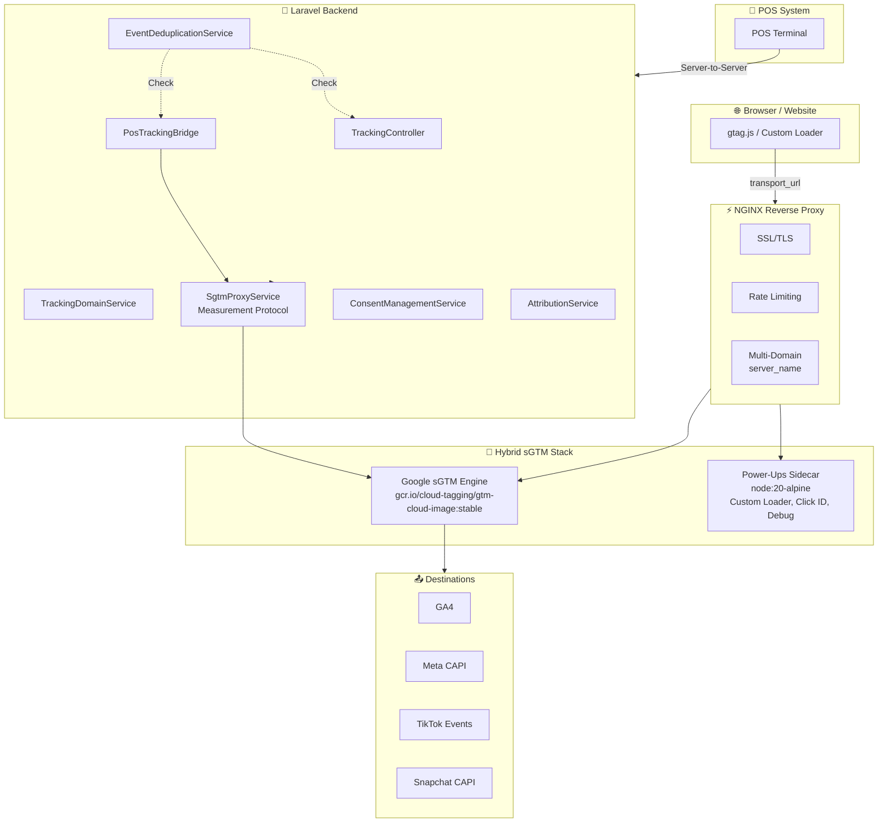

# 📡 Tracking Module — Complete Reference

> **Module Key**: `tracking` | Hybrid sGTM + Multi-Channel Server-Side Event Tracking
> Google Tag Manager + Facebook CAPI + GA4 Measurement Protocol + Multi-destination routing

---

## 🏗 Architecture Overview



---

## 🌐 Tracking Domain Architecture — 3 Cases

| Case | Domain | DNS | First-Party | Status |
|------|--------|-----|-------------|--------|
| **A: SaaS Auto** | `track.{tenant_id}.yoursaas.com` | None needed | ❌ Third-party | ✅ Instant |
| **B: Custom Domain** | `track.baseus.com.bd` | CNAME → `tracking.yoursaas.com` | ✅ First-party | Pending verify |
| **C: Existing Sub** | `shop.baseus.com.bd/track` | None | ⚠️ Shared | ⚠️ Not recommended |

### Onboard Flow

```
1. Tenant registers → ANY business category → tracking auto-activated (in core[])
2. ProvisionTenantJob → Step 4.5:
   a. Has custom domain (added/bought)? → track.{custom_domain} (CNAME pending)
   b. No custom domain? → track.{tenant_id}.yoursaas.com (instant ✅)
3. Dashboard → Tenant pastes GTM Config String → sGTM deploys
4. (Optional) Add custom domain later → CNAME → DNS verify → first-party cookies ✅
```


### Key Service: `TrackingDomainService`

| Method | Case | Description |
|--------|------|-------------|
| `provisionSaasTracking()` | A | Auto-generate SaaS subdomain, auto-verified |
| `registerCustomTracking()` | B | Custom domain + CNAME instructions |
| `useExistingSubdomain()` | C | Existing subdomain path (not recommended) |
| `suggestTrackingDomain()` | — | Suggest `track.{custom_domain}` from verified domains |
| `getTrackingDomain()` | — | Get active tracking domain (custom > SaaS priority) |
| `getAllTrackingDomains()` | — | Get all verified tracking domains for NGINX |
| `getTransportUrl()` | — | Get `https://` transport URL for gtag.js |
| `getDnsInstructions()` | B | CNAME + TXT verification records |

---

## 📂 Directory Structure

```
app/Modules/Tracking/
├── module.json
├── DOCUMENTATION.md              ← You are here
├── module_task.md
├── Actions/
│   ├── IngestEventAction.php           # Event ingestion pipeline
│   ├── ProcessEventAction.php          # Event processing & validation
│   └── RouteEventAction.php            # Fan-out to destinations
├── Console/
│   ├── ProcessDlqCommand.php           # Dead-letter queue processor
│   ├── PruneEventsCommand.php          # Old event cleanup
│   ├── SyncDestinationsCommand.php     # Destination health sync
│   └── TrackingReportCommand.php       # Analytics report generator
├── Controllers/
│   ├── DiagnosticsController.php       # System health & debug
│   ├── GatewayController.php           # Event ingestion endpoint
│   ├── InfrastructureController.php    # Container/proxy management
│   ├── ProxyController.php             # Server-side proxy
│   ├── SignalsController.php           # Signals gateway API
│   └── TrackingController.php          # Main tracking + domain management
├── DTOs/
├── Jobs/
│   ├── ProcessEventJob.php             # Async event processing
│   └── RetryDlqJob.php                # DLQ retry job
├── Services/
│   ├── AttributionService.php          # Cross-channel attribution
│   ├── ChannelHealthService.php        # Channel uptime monitoring
│   ├── ConsentManagementService.php    # GDPR/CCPA compliance
│   ├── DataFilterService.php           # PII filtering & redaction
│   ├── DatasetQualityService.php       # Data quality scoring
│   ├── DestinationService.php          # Multi-destination routing
│   ├── DirectIntegrationService.php    # Direct API integrations
│   ├── DockerOrchestratorService.php   # Container orchestration + NGINX
│   ├── EventDeduplicationService.php   # Web + POS event dedup (24h cache)
│   ├── EventEnrichmentService.php      # Event context enrichment
│   ├── EventValidationService.php      # Schema validation
│   ├── FieldMappingService.php         # Field transformation
│   ├── MetaCapiService.php             # Facebook Conversions API
│   ├── PosTrackingBridge.php           # POS → GA4 Measurement Protocol
│   ├── PowerUpService.php              # Power-up extensions
│   ├── RetryQueueService.php           # Failed event retry logic
│   ├── SgtmContainerService.php        # GTM Config String → container
│   ├── SgtmProxyService.php            # Proxy gtm.js/gtag.js + MP
│   ├── SignalsGatewayService.php       # Unified signal processing
│   ├── TagManagementService.php        # Tag container management
│   ├── TrackingAnalyticsService.php    # Analytics computations
│   ├── TrackingDomainService.php       # 3-case tracking domain handler
│   ├── TrackingProxyService.php        # Proxy configuration
│   ├── TrackingUsageService.php        # Usage metering
│   └── Channels/
│       ├── FacebookChannel.php         # FB Pixel/CAPI
│       ├── GoogleChannel.php           # GA4/GTM
│       ├── TikTokChannel.php           # TikTok Events API
│       ├── SnapchatChannel.php         # Snap CAPI
│       └── TwitterChannel.php          # Twitter CAPI
└── routes/
    └── api.php
```

---

## 🗄️ Database & Analytics Stack

This module operates on a high-performance modern data architecture designed to handle massive event volumes seamlessly.

| Purpose | Technology | Description |
|---------|------------|-------------|
| **Core Storage (Platform/Tenant)** | **MySQL** | Stores users, tenants, billing, container configs, and relational metadata. |
| **Main Tracking DB** | **ClickHouse** | The central analytical database for tracking billions of events, signals, and records at lightning speed. |
| **Event Pipeline & Caching** | **Kafka & Redis** | Kafka streams the high-throughput messages, while Redis handles caching, rate-limiting, and 24h event deduplication. |
| **Business & Marketing Reporting** | **Metabase** | BI UI connected to ClickHouse for generating stunning visual marketing and business reports. |
| **Monitoring & Event Logs** | **Grafana** | Operational UI layer for real-time visualization of server metrics, 10-day event logs, and infrastructure health. |

---

## 🗄️ Data Models| Model | Table | Key Fields |
|-------|-------|------------|
| `TrackingEventLog` | `tracking_event_logs` | `event_name`, `event_data`, `source`, `ip_address` |
| `TrackingContainer` | `tracking_containers` | `name`, `container_id`, `container_config`, `domain`, `extra_domains`, `docker_port` |
| `TrackingDestination` | `tracking_destinations` | `container_id`, `type`, `name`, `config`, `is_active` |
| `TrackingTag` | `tracking_tags` | `container_id`, `name`, `type`, `trigger_config` |
| `TrackingConsent` | `tracking_consents` | `user_id`, `consent_type`, `granted`, `expires_at` |
| `TrackingDlq` | `tracking_dlq` | `event_id`, `destination_id`, `error`, `retry_count` |
| `TrackingAttribution` | `tracking_attributions` | `session_id`, `channel`, `source`, `medium`, `campaign` |
| `TrackingChannelHealth` | `tracking_channel_health` | `channel`, `status`, `latency_ms`, `error_rate` |
| `TrackingUsage` | `tracking_usage` | `date`, `events_processed`, `events_failed` |
| `TenantDomain` | `tenant_domains` *(central)* | `tenant_id`, `domain`, `purpose`, `is_verified`, `status` |

---

## 🔌 API Routes

### Public (No Auth — Browser JS)
```
GET  /tracking/gtm.js           → Proxy gtm.js
GET  /tracking/gtag/js          → Proxy gtag.js
POST /tracking/mp/collect       → Measurement Protocol endpoint
```

### Admin (Auth Required)
```
# Container CRUD
GET    /tracking/containers                       → List
POST   /tracking/containers                       → Create (accepts container_config)
PUT    /tracking/containers/{id}                  → Update settings
GET    /tracking/containers/{id}/stats            → Event stats
GET    /tracking/containers/{id}/logs             → Event logs

# Destinations
GET    /tracking/containers/{id}/destinations     → List destinations
POST   /tracking/containers/{id}/destinations     → Add destination

# Usage & Analytics
GET    /tracking/containers/{id}/usage            → Usage summary
GET    /tracking/containers/{id}/usage/daily      → Daily breakdown
GET    /tracking/containers/{id}/analytics        → Analytics dashboard

# Power-Ups
GET    /tracking/power-ups                        → Available power-ups
PUT    /tracking/containers/{id}/power-ups        → Toggle power-ups

# Docker Control
POST   /tracking/containers/{id}/deploy           → Deploy sGTM stack
POST   /tracking/containers/{id}/provision        → Provision container
POST   /tracking/containers/{id}/deprovision      → Deprovision
GET    /tracking/containers/{id}/health           → Health check
PUT    /tracking/containers/{id}/domain           → Update primary domain

# Tracking Domain Management (3-Case)
POST   /tracking/containers/{id}/setup-domain     → Setup tracking domain (saas/custom/existing)
GET    /tracking/suggest-domain                   → Suggest from custom domains
GET    /tracking/containers/{id}/dns-instructions → DNS records for custom domain
POST   /tracking/containers/{id}/add-domain       → Add extra tracking domain

# Gateways
GET    /tracking/gateways                         → List
POST   /tracking/gateways                         → Create
DELETE /tracking/gateways/{id}                    → Delete

# Signals (Meta Signals Gateway)
POST   /tracking/signals/send                     → Send signal
GET    /tracking/signals/pipelines/{id}           → Get pipelines
PUT    /tracking/signals/pipelines/{id}           → Update pipelines
POST   /tracking/signals/validate                 → Validate event
GET    /tracking/signals/emq/{id}                 → Event Match Quality

# Diagnostics (Meta CAPI)
GET    /tracking/diagnostics/{id}/quality         → Data quality
GET    /tracking/diagnostics/{id}/match-keys      → Match keys
GET    /tracking/diagnostics/{id}/acr             → Additional conversions
POST   /tracking/diagnostics/test-event           → Test event

# DLQ / Retry
GET    /tracking/dlq/{id}/stats                   → DLQ stats
POST   /tracking/dlq/{id}/retry                   → Retry failed events
DELETE /tracking/dlq/purge                        → Purge DLQ

# Consent Management
POST   /tracking/consent/{id}                     → Record consent
GET    /tracking/consent/{id}/{visitorId}         → Get consent
GET    /tracking/consent/{id}/stats               → Consent stats
GET    /tracking/consent/{id}/banner              → Banner config

# Channel Health
GET    /tracking/health/{id}/dashboard            → Health dashboard
GET    /tracking/health/{id}/alerts               → Channel alerts

# Attribution
GET    /tracking/attribution/{id}                 → Attribution report
GET    /tracking/attribution/{id}/paths           → Conversion paths

# Tag Management
GET    /tracking/tags/{id}                        → List tags
POST   /tracking/tags/{id}                        → Create tag
PUT    /tracking/tags/items/{tagId}               → Update tag
DELETE /tracking/tags/items/{tagId}               → Delete tag
```

---

## 🐳 Docker Stack (Hybrid sGTM)

```yaml
# docker/docker-compose.tracking.yml → 3 containers per tenant
services:
  nginx:        # Reverse proxy, SSL, multi-domain, rate-limiting
  sgtm-engine:  # Google Official gcr.io/cloud-tagging/gtm-cloud-image:stable
  powerups:     # node:20-alpine — Custom Loader, Click ID, Debug UI
```

### NGINX Multi-Domain
```nginx
# DockerOrchestratorService → buildServerName()
server_name track.tenant.yoursaas.com track.custom-domain.com;
```

---

## 🔄 Multi-Channel Event Flow

### Web (eCommerce)
```
Website → gtag.js → transport_url (tracking domain) → NGINX → sGTM → GA4/Meta
```

### POS (Offline)
```
POS Terminal → Laravel API → PosTrackingBridge → Measurement Protocol → sGTM → GA4
```

### Deduplication
```
EventDeduplicationService (Cache, 24h TTL)
├── web_purchase_123 → process ✅
├── web_purchase_123 → retry → duplicate → skip ⏭
└── pos_purchase_456 → different event_id → process ✅
```

---

## 📋 Related Files (Outside Module)

| File | Purpose |
|------|---------|
| `app/Models/TenantDomain.php` | `scopeTracking()`, `getTrackingDomain()`, `purpose` column |
| `app/Jobs/ProvisionTenantJob.php` | Step 4.5: Auto-provision tracking subdomain |
| `database/migrations/2026_02_25_090000_add_purpose_to_tenant_domains.php` | `purpose` column migration |
| `docker/docker-compose.tracking.yml` | Docker stack definition |
