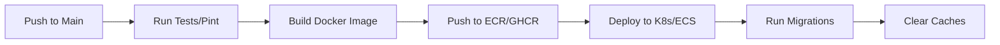

# 🚀 Deployment Plan: PixelMasters Multi-Tenant sGTM Platform

This document outlines the strategy for deploying the PixelMasters platform, covering both the central Laravel management application and the distributed tracking infrastructure.

## 🏗️ Architecture Overview

The platform uses a **hybrid architecture**:
1.  **Central Platform (Laravel + Vue/React)**: A single multi-tenant application managing users, subscriptions, and tenant configurations.
2.  **Distributed Tracking (sGTM + Sidecars)**: Per-tenant Google Tag Manager Server-Side containers, proxied via a shared or per-tenant Nginx instance.

---

## ☁️ 1. Infrastructure Requirements

### Recommended Provider: AWS (Alternative: GCP)

| Component | Service (AWS) | Specification |
| :--- | :--- | :--- |
| **Compute** | Amazon EKS (Kubernetes) or ECS (Fargate) | Multi-node cluster for high availability |
| **Primary Database** | Amazon RDS (MySQL 8.0) | Managed, multi-AZ, automated backups |
| **Cache & Queues** | Amazon ElastiCache (Redis) | Performance for session and real-time events |
| **Messaging** | Managed Kafka (MSK) or Confluent | For high-volume tracking data processing |
| **Storage** | Amazon S3 | Assets, logs, and tenant-specific exports |
| **Domains/DNS** | Route 53 | Support for wildcard domains (*.pixelmasters.com) |
| **SSL/TLS** | AWS Certificate Manager (ACM) | Wildcard certificates for subdomains |

---

## 📦 2. Core Application Deployment

The central Laravel app will be containerized using the existing `Dockerfile`.

### 🗄️ Database Strategy
*   **Central DB**: Stores `tenants`, `users`, `plans`, and `modules`.
*   **Tenant DBs**: Managed by `stancl/tenancy`. In production, these should all reside on the same RDS instance but in separate schemas to simplify management.

### 🚀 Container Management (Kubernetes / ECS)
1.  **Web Service**: PHP-FPM + Nginx (Sidecar or Load Balancer).
2.  **Worker Service**: Dedicated containers for `php artisan queue:work`.
3.  **Scheduler**: A single-replica pod running the Laravel scheduler.

---

## 🌐 3. Multi-Tenancy & Domains

### Domain Management
*   **Admin Dashboard**: `admin.pixelmasters.com` (Central app)
*   **Tenant Dashboards**: `{tenant_id}.pixelmasters.com`
*   **Tracking Endpoints**: `gtm.{client-domain}.com` (First-party tracking)

### SSL Orchestration
*   For `*.pixelmasters.com`, use a single wildcard ACM certificate.
*   For **Custom Domains** (e.g., `gtm.client-site.com`), we need a dynamic SSL solution like **Caddy Server** or **Nginx with OpenResty (Lua)** to automatically provision Let's Encrypt certificates when a client maps their CNAME.

---

## 🎯 4. Tracking Infrastructure (sGTM)

The tracking stack is the most resource-intensive part.

### Deployment Tiers:
1.  **Essential (Shared)**: Multiple small tenants share a single sGTM cluster.
2.  **Premium (Dedicated)**: Each tenant gets their own `sgtm-engine` and `powerups-sidecar` containers (as defined in `docker-compose.tracking.yml`).

### Implementation Workflow:
1.  User enters GTM Configuration in the Dashboard.
2.  Laravel triggers a workflow to provision a new K8s Deployment/Service or ECS Task.
3.  Nginx configuration is updated (or a dynamic proxy picks up the new route).

---

## 🔄 5. CI/CD Pipeline (GitHub Actions)

---

## 🛡️ 6. Monitoring & Maintenance

*   **Logs**: CloudWatch or ELK Stack for centralized logging.
*   **Metrics**: Prometheus & Grafana for monitoring cluster health, request latency, and memory usage.
*   **Health Checks**: Implementation of `/health` endpoints in Laravel and sGTM sidecars.
*   **Backups**: Daily automated snapshots of RDS; S3 versioning for static assets.

---

## 🚩 Next Steps

1.  [ ] **Select Environment**: Decide between AWS Managed Services or a simpler DigitalOcean/Hetzner setup for the MVP.
2.  [ ] **Configure Secrets**: Set up AWS Secrets Manager or GitHub Secrets for `.env` variables.
3.  [ ] **Dynamic Domain Proof-of-Concept**: Test Caddy/Nginx for automatic custom domain SSL.
4.  [ ] **Load Testing**: Validate the sGTM sidecar performance under high traffic.
