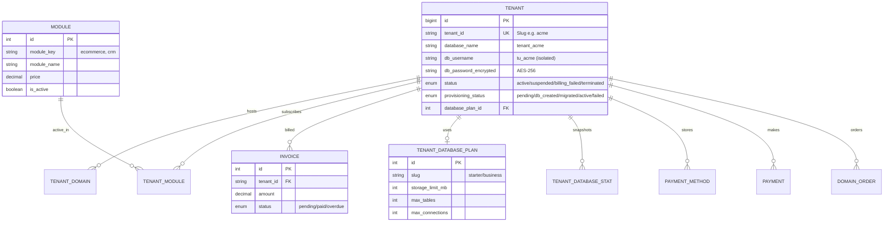
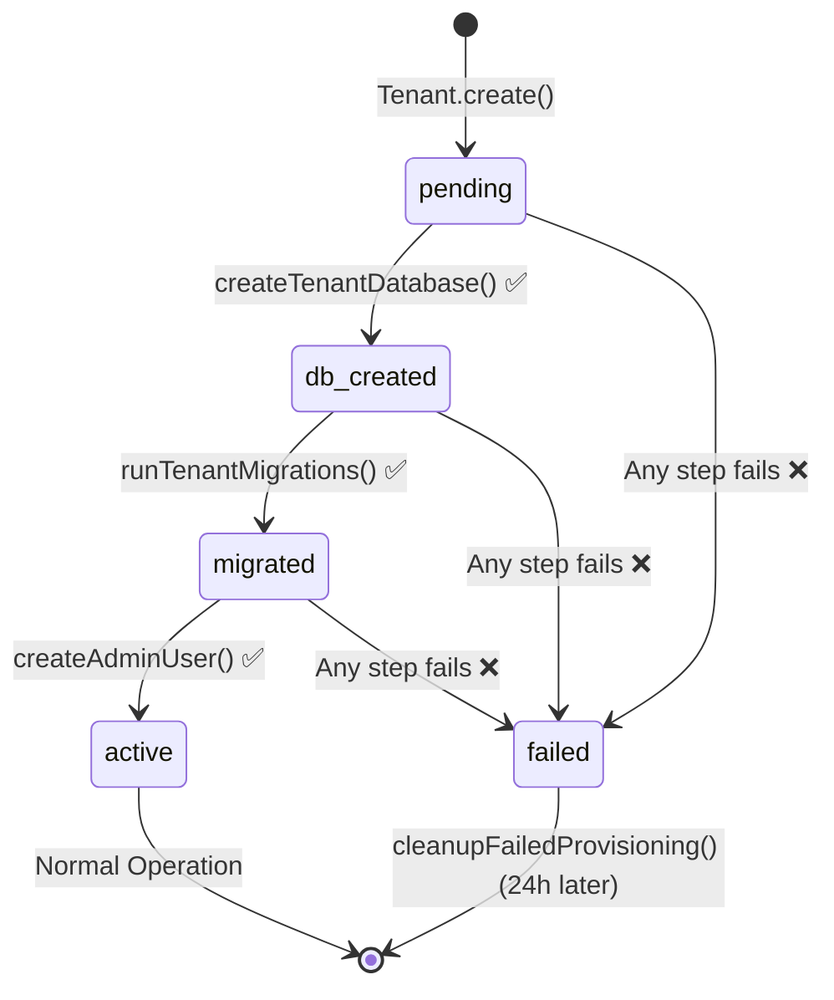

# Multi-Tenant Platform: System Architecture

---

## 1. Database Architecture (ERD)

**Dual-Database Strategy:**
- **Master DB (`mysql`)** → Platform-wide metadata: tenants, billing, modules.
- **Tenant DB (`tenant_dynamic`)** → Isolated per-tenant data: users, products, orders.

---

## 2. Complete Feature Map

### 🌍 Models (Master DB)

| Model | Connection | Key Features |
|---|---|---|
| `Tenant` | `mysql` | Slug ID, encrypted DB creds, provisioning state machine (`pending→active`), status control (`active/suspended/terminated`). Relations: domains, modules, invoices, payments, stats, plan. |
| `TenantDomain` | `mysql` | Subdomain/custom domain records. Fields: `is_primary`, `is_verified`, `status`. |
| `TenantModule` | `mysql` | Junction table for subscriptions. Fields: `status`, `expires_at`, `auto_renew`, `price_paid`. Scopes: `active()`. |
| `TenantDatabasePlan` | `mysql` | Storage plans. Fields: `storage_limit_mb`, `max_tables`, `max_connections`, `price`. Scopes: `active()`. |
| `TenantDatabaseStat` | `mysql` | Time-series snapshots of tenant DB size. Fields: `database_size_mb`, `slow_query_count`, `write_operation_count`, `top_tables_by_growth` (JSON). |
| `Module` | `mysql` | Platform-wide feature definitions. Relations: `tenantModules`, `activeSubscriptions`. |
| `Invoice` | `mysql` | Billing records per tenant. Fields: `status`, `due_date`, `paid_at`. |
| `Payment` | `mysql` | Stripe payment records. Fields: `stripe_session_id`, `stripe_payment_intent_id`, `amount_paid`, `status`. |
| `PaymentMethod` | `mysql` | Saved cards per tenant. Fields: `stripe_payment_method_id`, `brand`, `last_four`, `is_default`. |
| `DomainOrder` | `mysql` | Namecheap domain purchase records. Fields: `domain_name`, `years`, `expires_at`, `status`. |
| `SuperAdmin` | `mysql` | Platform admin accounts. Uses Sanctum for authentication. |

### 🧩 Models (Tenant DB)

| Model | Connection | Key Features |
|---|---|---|
| `User` | `tenant_dynamic` | Per-tenant users. Fields: `role (admin/manager/user)`, `status`. Uses Sanctum. |
| `TenantBaseModel` | `tenant_dynamic` | Abstract base model. Hard-codes `tenant_dynamic` connection for all tenant models to prevent accidental cross-DB queries. |
| `Ecommerce\Product`, `Order`, `Customer`, etc. | `tenant_dynamic` | All extend `TenantBaseModel`. Scoped to the current tenant's isolated database automatically. |

---

### 🎮 Controllers (`app/Http/Controllers/Api`)

| Controller | Route Prefix | Methods & Features |
|---|---|---|
| **AuthController** | `/api/auth` | `register`, `login`, `logout`, `me`. Custom JWT-style token generation (HS256). Reads/writes from `tenant_dynamic` (raw DB layer). |
| **TenantController** | `/api/tenants` | `register` (full provisioning with 11-field validation), `show` (by ID), `current` (from request context), `index` (all tenants). |
| **UserController** | `/api/users` | CRUD: `index`, `store`, `show`, `update`, `destroy`. Manages users within the tenant's isolated DB. |
| **SubscriptionController** | `/api/modules` | `index` (all available modules), `tenantModules` (subscribed), `subscribe`, `unsubscribe`, `checkAccess`. |
| **PaymentController** | `/api/payment` | `createCheckoutSession` (Stripe), `verifyPayment` (polls Stripe directly, no webhook needed), `stripeWebhook`, `activateSubscription` (auto-runs module migrations post-payment), `calculatePrice` (monthly/yearly discounts), `calculateExpiryDate`, `getPaymentStatus`. |
| **InvoiceController** | `/api/invoices` | `index` (filterable & paginated), `show` (with line items), `download` (PDF), `pay` (creates new Stripe checkout for unpaid invoice). |
| **PaymentMethodController** | `/api/payment-methods` | `index`, `store` (Stripe card attach), `destroy`, `setDefault`. |
| **PaymentHistoryController** | `/api/payment/history` | `index` (paginated history), `statistics` (total spend, count, avg), `downloadInvoice`. |
| **TenantDatabaseController** | `/api/database` | `analytics` (usage + quota + alerts), `tables` (per-table breakdown), `growth` (N-day trend), `plans` (available upgrade plans). |
| **DomainController** | `/api/domains` | `index`, `store`, `verify` (DNS check), `setPrimary`, `getDNSHosts`, `updateDNSHosts`, `getNameservers`, `renew`, `destroy`. |
| **DomainStoreController** | `/api/domains/store` | `search` (Namecheap availability), `whois`, `purchase` (Stripe checkout), `repay`, `verifyPurchase` (post-payment domain registration), `orders` (order history), `show`, `syncOrder`, `renewOrder`. |
| **ModuleManagementController** | `/api/super-admin/modules` | `upload` (install from ZIP via `module.json`), `index` (search/filter), `store`, `update`, `destroy` (blocks if active subscriptions exist). |
| **SuperAdminController** | `/api/super-admin` | `dashboard` (platform stats), `tenants` (list all), `tenantDetails`, `approveTenant`, `suspendTenant`, `deleteTenant`. |
| **SuperAdminAuthController** | `/api/super-admin` | `login`, `logout`, `me`, `changePassword`. Uses Laravel Sanctum. |

---

### 🛡️ Middlewares (`app/Http/Middleware`)

| Middleware | Alias | Applied On | Features |
|---|---|---|---|
| `IdentifyTenant` | _(class ref)_ | All tenant routes | Resolves tenant from `X-Tenant-ID` header → custom domain lookup → subdomain extraction. Switches `tenant_dynamic` DB. Blocks `suspended/terminated/billing_failed` tenants. |
| `AuthenticateToken` | _(class ref)_ | Protected tenant routes | Validates custom HS256 JWT. Decodes user ID and tenant ID from token. Attaches `user_id` to request. |
| `CheckModuleAccess` | `module.access` | Ecommerce routes (`module.access:ecommerce`) | Checks `TenantModule` subscription record. Returns `402 Payment Required` if inactive. |
| `EnforceDatabaseQuota` | `quota.enforce` | Write routes (POST/PUT/PATCH) | Checks latest `TenantDatabaseStat` against `TenantDatabasePlan`. Blocks if storage **or** table limit exceeded. |
| `DynamicCors` | _(auto)_ | All routes | Dynamically sets CORS `Allow-Origin` based on verified tenant domains. Prevents cross-tenant cookie/session attacks. |

---

### ⚙️ Services (`app/Services`)

| Service | Features |
|---|---|
| `DatabaseManager` | `createTenantDatabase`, `runTenantMigrations` (raw SQL: `users` + `personal_access_tokens`), `createAdminUser`, `switchToTenantDatabase` (purges & reconnects `tenant_dynamic`), `getTenantConnection` (connection cache). |
| `TenantService` | **State machine provisioning** (`pending→db_created→migrated→active/failed`). `createTenant` (atomic, 5-step). `cleanupFailedProvisioning` (deletes stale `failed/pending` tenants). `getAllTenants`, `getTenantByTenantId`. |
| `TenantDatabaseIsolationService` | `createIsolatedUser` (MySQL `CREATE USER ... GRANT` to single DB only). `revokeAccess`, `dropIsolatedUser`. `setStoragePlan`, `checkQuotaUsage`, `isOverQuota`. |
| `TenantDatabaseAnalyticsService` | `collectStats` (from `INFORMATION_SCHEMA` + `performance_schema`: size, rows, slow queries, write ops). `collectAllStats` (for all active tenants). `getAnalytics` (quota-aware response). `getTableBreakdown`, `getGrowthTrend` (daily grouping). `detectSchemaDrift` (compares actual vs expected tables). |
| `ModuleMigrationManager` | `runModuleMigrations` (with **row-level lock** + **quota check** before executing). `rollbackModuleMigrations` (**non-destructive**: archives tables by rename). `archiveModuleTables` (supports both raw SQL and `Schema::create` patterns). Batch tracking via `module_migrations` master table. |
| `ModuleService` | `subscribeModule` (transactional: creates subscription → runs migrations). `unsubscribeModule` (sets inactive → archives tables). `isModuleActive`, `getTenantModules`, `getAvailableModules`, `getModuleStats`. |
| `BillingEnforcementService` | Scheduled agent. Finds tenants with overdue invoices (> 3 days). Updates tenant `status` to `billing_failed`. Calls `IsolationService.revokeAccess`. |
| `DomainService` | Custom domain management, DNS record CRUD, Namecheap API integration for DNS host updates and nameserver management. |
| `DomainSearchService` | Domain availability search, pricing, TLD suggestions via Namecheap API. |
| `DomainRegistrationService` | Domain registration flow, WHOIS data, multi-year registration. |
| `NamecheapService` | Core Namecheap API client. Methods: `checkDomains`, `registerDomain`, `getDNSHosts`, `setDNSHosts`, `getNameservers`, `setNameservers`, `renewDomain`. Configurable sandbox/live mode. |
| `TenantBackupService` | Database snapshot and backup utilities for tenant databases. |

---

### 📦 Modules (`app/Modules`)

#### Ecommerce Module (`app/Modules/Ecommerce/`)

| Component | Features |
|---|---|
| **ProductController** | Full CRUD for products. Supports categories, pricing, stock. |
| **CategoryController** | Full CRUD for product categories. |
| **OrderController** | Full CRUD for orders. Order status management. |
| **CustomerController** | Full CRUD for customers. Customer profile management. |
| **EcommerceDashboardController** | `stats` endpoint: total products, orders, customers, revenue. |
| **Migrations** | `ec_products`, `ec_orders`, `ec_order_items`, `ec_customers`, `ec_categories` tables. Installed on-demand via `ModuleMigrationManager`. |

> All Ecommerce routes are protected by **3 middleware layers**: `AuthenticateToken` (must be logged in) + `module.access:ecommerce` (must have an active subscription) + `quota.enforce` (cannot exceed storage limit).

---

### 🛣️ Route Map (`routes/api.php`)

| Group | Middleware Stack | Endpoints |
|---|---|---|
| **Public** | none | `GET /health`, `POST /stripe/webhook` |
| **Tenant Public** | none | `POST /tenants/register`, `GET /tenants/{id}`, `GET /tenants` |
| **Super Admin** | `auth:sanctum` | `/super-admin/login`, `/me`, `/dashboard`, `/tenants (CRUD)`, `/modules (CRUD + upload)` |
| **Tenant Identified** | `IdentifyTenant` | `GET /tenants/current` |
| **Tenant Auth** | `IdentifyTenant` | `POST /auth/register`, `POST /auth/login`, `POST /auth/logout`, `GET /auth/me` |
| **Users** | `IdentifyTenant + AuthenticateToken + quota.enforce` | Full CRUD `/users` |
| **Modules/Subscriptions** | `IdentifyTenant + AuthenticateToken` | `GET/POST /modules`, `/modules/{key}/access` |
| **Payments** | `IdentifyTenant + AuthenticateToken` | `/payment/checkout`, `/verify`, `/{id}/status`, `/history`, `/statistics` |
| **Invoices** | `IdentifyTenant + AuthenticateToken` | Full CRUD `/invoices`, `/{id}/download`, `/{id}/pay` |
| **Payment Methods** | `IdentifyTenant + AuthenticateToken` | Full CRUD `/payment-methods`, `/{id}/default` |
| **Database Analytics** | `IdentifyTenant + AuthenticateToken` | `GET /database/analytics`, `/tables`, `/growth`, `/plans` |
| **Domains** | `IdentifyTenant + AuthenticateToken` | Full CRUD + `/verify`, `/dns`, `/nameservers`, `/renew` |
| **Domain Store** | `IdentifyTenant + AuthenticateToken` | `/store/search`, `/whois`, `/purchase`, `/verify-purchase`, `orders` |
| **Ecommerce** | `IdentifyTenant + AuthenticateToken + module.access:ecommerce + quota.enforce` | Full CRUD for products, categories, orders, customers + `/stats` |

---

## 3. Provisioning State Machine

---

## 4. Security Architecture

| Layer | Protection |
|---|---|
| **Database Isolation** | Each tenant has a unique MySQL user with `GRANT` only to their own DB. Cross-DB access is impossible. |
| **Credential Encryption** | `db_password_encrypted` uses Laravel `encrypted` cast (AES-256-CBC). Never stored in plain text. |
| **Request Isolation** | `IdentifyTenant` switches `tenant_dynamic` connection per request. Cannot touch another tenant's DB. |
| **Queue Guard** | `AppServiceProvider` intercepts every queued job and calls `applyTenantContext()` before execution. |
| **Kill Switch** | `IdentifyTenant` blocks requests immediately if tenant status = `suspended`, `billing_failed`, or `terminated`. |
| **Dynamic CORS** | `DynamicCors` validates request origin against verified `TenantDomain` records to prevent cross-tenant attacks. |
