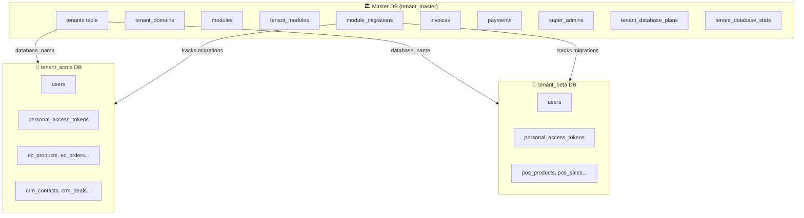
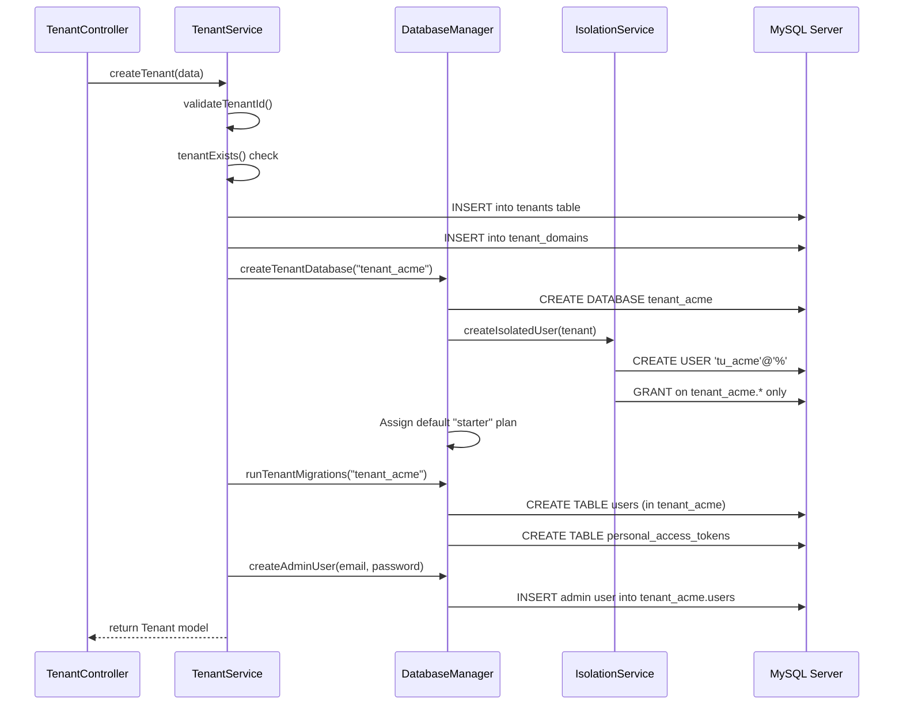
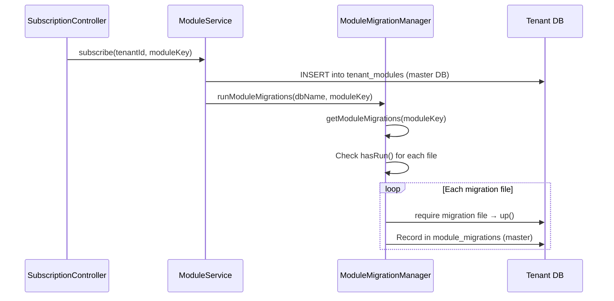
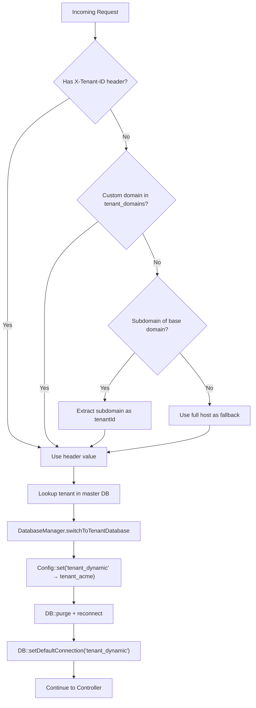

# Tenant Database Server & Migration Process — Complete Guide

## Architecture Overview



### Dual-Database Strategy

| Concern | Master DB (`tenant_master`) | Tenant DB (`tenant_{id}`) |
|---|---|---|
| **Connection** | `mysql` (default) | `tenant_dynamic` (runtime) |
| **Contains** | Tenants, modules, payments, invoices, super admins | Users, module-specific tables |
| **Migrations** | `database/migrations/` + `database/migrations/master/` | Raw SQL in `DatabaseManager` + module migrations |
| **Access** | Platform admin credentials | Isolated MySQL user per tenant |

---

## Tenant Lifecycle: Registration → DB Creation → Migration

### Step 1: API Call — `POST /api/tenants/register`

[TenantController.php](file:///e:/Mern%20Stact%20Dev/multi-tenant-mern/multi-tenant-laravel/app/Http/Controllers/Api/TenantController.php) validates input and calls `TenantService.createTenant()`.

### Step 2: TenantService Orchestration

[TenantService.php](file:///e:/Mern%20Stact%20Dev/multi-tenant-mern/multi-tenant-laravel/app/Services/TenantService.php) — `createTenant()` does the following in order:



### Step 3: Database Creation

[DatabaseManager.php](file:///e:/Mern%20Stact%20Dev/multi-tenant-mern/multi-tenant-laravel/app/Services/DatabaseManager.php) — `createTenantDatabase()`

```sql
CREATE DATABASE IF NOT EXISTS `tenant_acme`
    CHARACTER SET utf8mb4
    COLLATE utf8mb4_unicode_ci;
```

Then creates an **isolated MySQL user**:

```sql
CREATE USER 'tu_acme'@'%' IDENTIFIED BY '<random_32_char>';
GRANT SELECT, INSERT, UPDATE, DELETE, CREATE, ALTER, DROP, INDEX, REFERENCES
    ON `tenant_acme`.* TO 'tu_acme'@'%';
-- No SUPER, FILE, PROCESS, GRANT OPTION
FLUSH PRIVILEGES;
```

### Step 4: Core Migrations (Raw SQL)

`DatabaseManager.runTenantMigrations()` creates **2 base tables** in every tenant DB:

| Table | Purpose |
|---|---|
| `users` | Tenant's users with role (admin/manager/user) and status |
| `personal_access_tokens` | Sanctum tokens for API auth |

These use raw SQL, not Laravel migration files — they're hardcoded to ensure every tenant gets an identical base schema.

### Step 5: Admin User Seeding

`DatabaseManager.createAdminUser()` inserts the first admin user with hashed password.

---

## Module Migrations (On-Demand)

When a tenant **subscribes to a module**, additional tables are created in their DB.

### Flow: Subscribe → Migrate



### Migration File Locations

[ModuleMigrationManager.php](file:///e:/Mern%20Stact%20Dev/multi-tenant-mern/multi-tenant-laravel/app/Services/ModuleMigrationManager.php) looks for migrations in **two places** (priority order):

```
1. app/Modules/{Module}/database/migrations/     ← Dynamic modules (uploaded)
2. database/migrations/tenant/modules/{key}/      ← Built-in modules (legacy)
```

### Current Tenant Module Migrations

| Module | Tables Created | Migration Files |
|---|---|---|
| **Ecommerce** (9 files) | `ec_products`, `ec_customers`, `ec_orders`, `ec_order_items`, `ec_categories`, `ec_product_variants`, `ec_carts`, `ec_coupons`, `ec_reviews` | [ecommerce/](file:///e:/Mern%20Stact%20Dev/multi-tenant-mern/multi-tenant-laravel/database/migrations/tenant/modules/ecommerce) |
| **CRM** (3 files) | `crm_contacts`, `crm_deals`, `crm_activities` | [crm/](file:///e:/Mern%20Stact%20Dev/multi-tenant-mern/multi-tenant-laravel/database/migrations/tenant/modules/crm) |
| **POS** (3 files) | `pos_products`, `pos_sales`, `pos_sale_items` | [pos/](file:///e:/Mern%20Stact%20Dev/multi-tenant-mern/multi-tenant-laravel/database/migrations/tenant/modules/pos) |

### Migration Tracking (`module_migrations` table — Master DB)

| Column | Purpose |
|---|---|
| `tenant_database` | Which DB this ran on (e.g., `tenant_acme`) |
| `module_key` | Module identifier (e.g., `ecommerce`) |
| `migration_file` | Filename (e.g., `2026_02_17_000001_create_ec_products_table.php`) |
| `batch` | Batch number for rollback ordering |

### Rollback (Unsubscribe)

When unsubscribing, `ModuleMigrationManager.rollbackModuleMigrations()` runs `down()` on each migration **in reverse order** and removes the tracking record.

---

## Request-Level DB Switching

Every API request goes through the [IdentifyTenant](file:///e:/Mern%20Stact%20Dev/multi-tenant-mern/multi-tenant-laravel/app/Http/Middleware/IdentifyTenant.php) middleware:



### Connection Configuration ([config/tenant.php](file:///e:/Mern%20Stact%20Dev/multi-tenant-mern/multi-tenant-laravel/config/tenant.php))

```
TENANT_DB_HOST     → defaults to DB_HOST (127.0.0.1)
TENANT_DB_PORT     → defaults to DB_PORT (3306)
TENANT_DB_USERNAME → defaults to DB_USERNAME
TENANT_DB_PASSWORD → defaults to DB_PASSWORD
TENANT_DB_PREFIX   → "tenant_" (e.g., tenant_acme)
```

---

## Storage Plans & Quotas

```
┌──────────────┬──────────┬────────────┬─────────────────┬────────┐
│ Plan         │ Storage  │ Max Tables │ Max Connections  │ Price  │
├──────────────┼──────────┼────────────┼─────────────────┼────────┤
│ Starter      │ 10 GB    │ 50         │ 10              │ Free   │
│ Business     │ 15 GB    │ 100        │ 25              │ $29.99 │
│ Enterprise   │ 20 GB    │ Unlimited  │ 50              │ $59.99 │
└──────────────┴──────────┴────────────┴─────────────────┴────────┘
```

Stats collected **hourly** via `php artisan tenant:collect-db-stats` using `INFORMATION_SCHEMA.TABLES`.

---

## Full File Map

| File | Role |
|---|---|
| [config/tenant.php](file:///e:/Mern%20Stact%20Dev/multi-tenant-mern/multi-tenant-laravel/config/tenant.php) | DB connection config, prefix, identification methods |
| [DatabaseManager.php](file:///e:/Mern%20Stact%20Dev/multi-tenant-mern/multi-tenant-laravel/app/Services/DatabaseManager.php) | Create DB, core migrations, connections, switching |
| [TenantService.php](file:///e:/Mern%20Stact%20Dev/multi-tenant-mern/multi-tenant-laravel/app/Services/TenantService.php) | Orchestrates full tenant provisioning |
| [ModuleMigrationManager.php](file:///e:/Mern%20Stact%20Dev/multi-tenant-mern/multi-tenant-laravel/app/Services/ModuleMigrationManager.php) | Module-specific migration run/rollback + tracking |
| [TenantDatabaseIsolationService.php](file:///e:/Mern%20Stact%20Dev/multi-tenant-mern/multi-tenant-laravel/app/Services/TenantDatabaseIsolationService.php) | MySQL user isolation, quota checks |
| [TenantDatabaseAnalyticsService.php](file:///e:/Mern%20Stact%20Dev/multi-tenant-mern/multi-tenant-laravel/app/Services/TenantDatabaseAnalyticsService.php) | INFORMATION_SCHEMA stats collection |
| [IdentifyTenant.php](file:///e:/Mern%20Stact%20Dev/multi-tenant-mern/multi-tenant-laravel/app/Http/Middleware/IdentifyTenant.php) | Middleware: identify tenant → switch DB |
| [TenantDatabaseController.php](file:///e:/Mern%20Stact%20Dev/multi-tenant-mern/multi-tenant-laravel/app/Http/Controllers/Api/TenantDatabaseController.php) | Analytics API (4 endpoints) |
| [CollectDatabaseStats.php](file:///e:/Mern%20Stact%20Dev/multi-tenant-mern/multi-tenant-laravel/app/Console/Commands/CollectDatabaseStats.php) | Hourly stats collection command |
